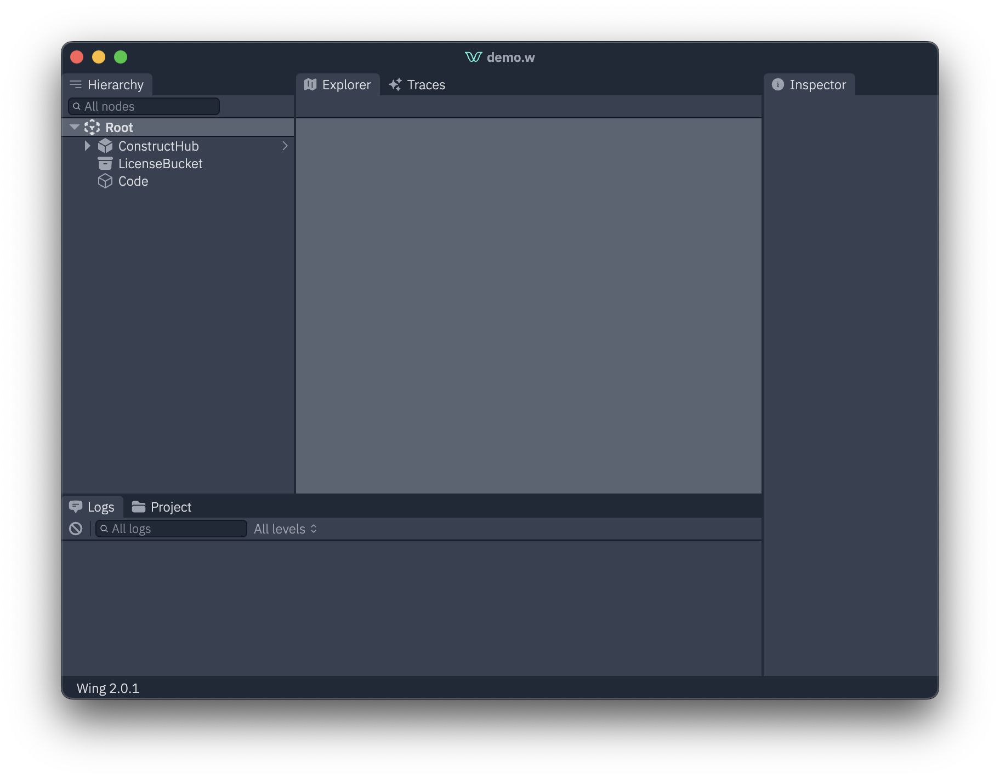
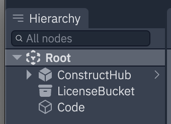
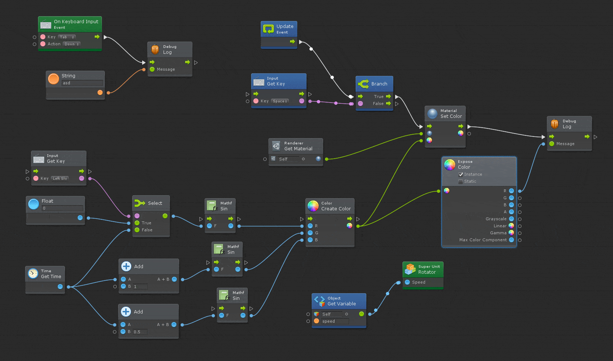
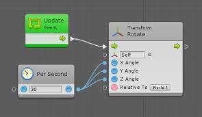

# Console Ideas

## Improve the Panels design

The panels should be separated by thicker lines, and come in a tab fashion. That should make the panels more readable.



## Identify User Classes



The ConstructHub in the image above is a class created by a user, similar to the following:

```wing
bring cloud;
class ConstructHub {
    bucket: cloud.Bucket;
    init() {
        this.bucket = new cloud.Bucket();
    }
}
```

The Console should:

- Identify the user classes
- Hide their implementation by default
  - Meaning, it's children are hidden from the map
  - Allow the user to expand the class to see it's children
- Allow inspecting the class:
  - Show the class type (eg: `ConstructHub`)
  - Show where the class is declared / implemented (which file and line)
  - Show the class's properties and children
- Allow customizing icon and color for the class
- Show the class's documentation

## The Project tab

The project tab should show the project's metadata, such as files, classes and resources, including the ones from external libraries.

## The Test Runner

The test runner should:

- Become a tab at the bottom
- Run the tests automatically on every change
- Display the test logs in its own log panel

## Hide Autogenerated Node Names

The Wing Compiler will generate nodes with names like `Topic-OnMessage-1nf2334d`. These names aren't identifiable by the user since they didn't create them, so they should be hidden by default, and only shown when the user hovers the node or clicks on it.

## Remove Root Node

The root node is of no use to the user. It has no properties and its only purpose is to please cdktf.

Removing this node should decrease the map clutter and make it more readable.

## Use a different technology for the Map

The current map can't handle medium to large projects. It's slow due to react's rendering system. It should be replaced with a different technology.

Interesting choices:

- Canvas and/or WebGL
- SolidJS
- SVG

## Animate the Connections when Events occur




## Wing Concept: Resource Inputs and Outputs



The ports on the left are inputs, and the ones on the right are outputs.

Inputs are the equivalent to invokable functions, and the outputs are the equivalent to events or signals.

Resources such as the Scheduler will only have outputs (onTick, for example). Resources such as a Function will have the `invoke` input and the `onInvoked` output. A Bucket will have `putFile` and `onFileCreated`.

## Show Type Information

Every resource input and output may have a type signature. A Function may accept an object of type `type Input = { userId: number; userName: string }`, so the invoke signature will be `invoke(input: { userId: number; userName: string })`.

## Other Ideas

- Display a config pane that exposes the ELK parameters
- Add minimap
- Add Vercel previews
- Add traces panel
